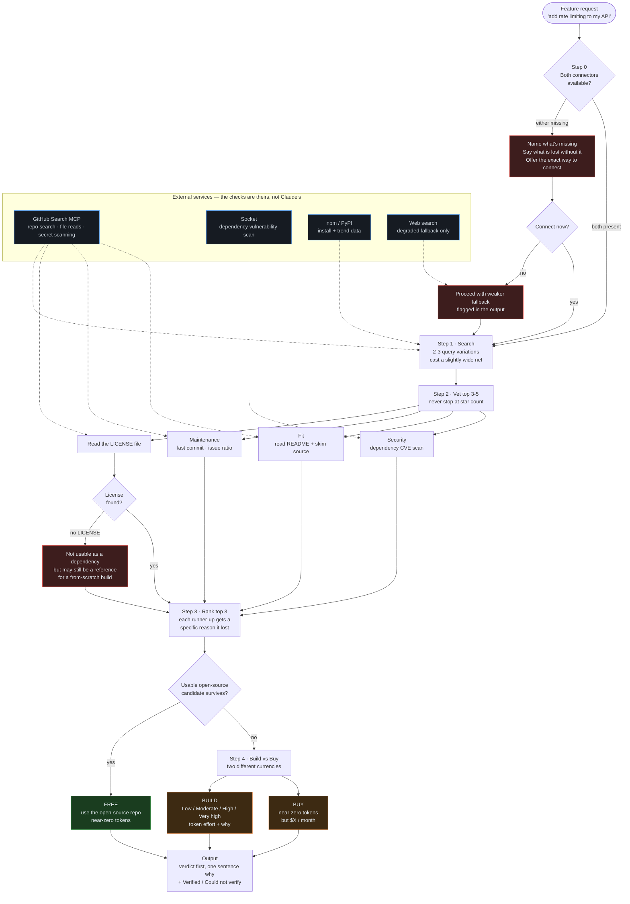

# dont-reinvent

**Stop your AI coding agent from reinventing the wheel. Save the tokens instead.**

A Claude Skill that checks Free vs. Build vs. Buy before writing non-trivial code, and actually vets what it finds (license, maintenance, security) instead of stopping at star count.

## Install

As a Claude Code plugin:

```
/plugin marketplace add Emanuelel/dont-reinvent
/plugin install dont-reinvent@emanuelel-dont-reinvent
```

Or manually, by copying the skill into your skills directory:

```
git clone https://github.com/Emanuelel/dont-reinvent.git
cp -r dont-reinvent/skills/dont-reinvent ~/.claude/skills/
```

## Why this matters more now, not less

Build vs. buy used to be a slow decision. A developer's time and salary were the real cost of "build," so people naturally checked npm, Stack Overflow, or a vendor page first. Buying or reusing was often the *faster* path, and that friction kept the decision honest.

Agentic coding changes the economics, but not in the direction it looks like at first. Now that an AI agent can generate a working implementation of almost anything on request, building *feels* free and instant, so the path of least resistance quietly became "just build it," every time, by default. It isn't actually free. Every non-trivial feature costs real tokens: not just the first draft, but the edge cases, the debugging rounds, the security holes nobody thought to check. The old instinct to check "has someone already solved this" used to happen almost automatically. Now it gets skipped entirely, because asking an agent to build feels like the path of least resistance.

The result: left to its own defaults, an AI coding agent will happily hand-roll a rate limiter, a multi-model LLM router, a site audit tool, or a social-automation feature completely from scratch, even when a free, mature, actively maintained open-source project already does the job, more safely, for a small fraction of the token cost.

This skill exists to interrupt that default, one decision at a time.

## Free, Build, or Buy: three options, not two

Not "build vs. buy." That framing hides the option that matters most.

- **Free**: an existing open-source solution, actually vetted (license, maintenance, security), not just found
- **Build**: write it from scratch, estimated in token-effort tiers (Low / Moderate / High / Very high), never a fake precise number
- **Buy**: pay for a hosted API/service, priced in real dollars/month

Free and Buy are both near-zero token cost to integrate: a search, a license check, an install. Only Build spends real tokens. That contrast is the whole point.

## What it actually checks, not just stars

- **License**: reads the actual LICENSE file. No license found is a real blocker (can't legally redistribute or rely on the code), not a footnote, though it may still be a useful reference for a from-scratch build.
- **Maintenance**: last commit date, open/closed issue ratio, whether it looks abandoned mid-build.
- **Security**: runs a real dependency vulnerability scan on the candidate's actual dependencies, catching known CVEs in pinned versions.
- **Fit**: reads the actual README and source rather than trusting the description.

The output leads with one plain-language sentence: the recommendation plus the one fact that matters (a blocker, a cost, or why it's safe). Full ranked detail is available on request, never dumped by default.

## What it's caught, in testing

Real results, generalized here to the problem category rather than any specific project:

- Asked to build **API rate limiting** from scratch: found a mature, MIT-licensed, actively maintained open-source library, clean on every security check. Near-zero tokens to integrate instead of several rounds of hand-rolled implementation.
- Asked to build **cost-based multi-model LLM routing** from scratch: found a production-grade open-source gateway (50k+ stars, updated hours before the check) already solving exactly this. The clearest case of what building from scratch would have meant re-solving.
- Asked to build **comment-triggered social media automation** from scratch: found a candidate, but it had no license and known vulnerabilities in its own dependencies. Correctly recommended building instead, with the specific risk explained in plain language, not hidden in a score nobody would read.
- Asked to build **a technical site/content audit tool** from scratch: found a directly overlapping, MIT-licensed, actively maintained package taking the same technical approach. A case where adopting it outright beat building.

Roughly half of all test cases correctly said **build**, when the free candidate was thin, unlicensed, or unsafe. The goal isn't "always avoid building." It's making sure that call is actually informed instead of assumed.

## How it works

The decision flow, and which service does the actual checking at each step. Dotted lines are external services — the skill never asserts a license, a maintenance signal, or a CVE without one of them backing it.



**Reading it in one line:** everything left of Step 4 is trying to avoid spending tokens; Step 4 only runs when that genuinely failed.

## Required connectors

- **GitHub search MCP**: real repo search, license/file reads, secret scanning
- **A dependency security scanner MCP** (e.g. Socket): vulnerability scoring on a candidate's actual dependencies

If either is missing, the skill says so explicitly and offers to help connect it. It never silently falls back to a weaker check without flagging it.

## Design notes

- A missing license isn't automatically disqualifying. It's a two-track finding: not usable as a dependency, but often still a legitimate reference for a from-scratch build.
- Security output is always one sentence, never a raw score table. Full detail exists on request, not by default.
- Cost comparisons are stated in plain, concrete terms, never finance jargon like "breakeven."
- Known gap: the skill has no built-in awareness of a project's own constraints (language, dependency limits, etc.), so a strong candidate in the wrong language/ecosystem can still surface as a top result. A project-context mechanism would close this, deferred until real use shows it's needed often enough to justify building.
- Never silently degrades. Missing a required connector means saying so, not quietly doing a worse job with the same confidence as a full check.

## Status

Working, tested against real build-vs-buy calls across several problem domains. Currently in active personal use, not yet packaged for wider distribution.
